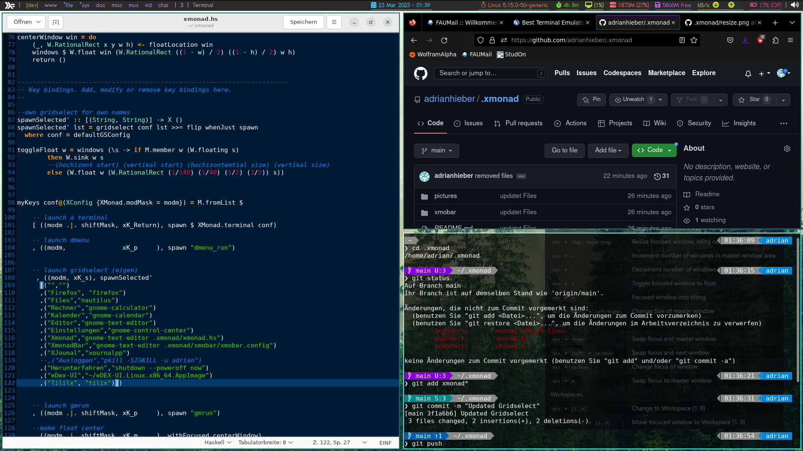
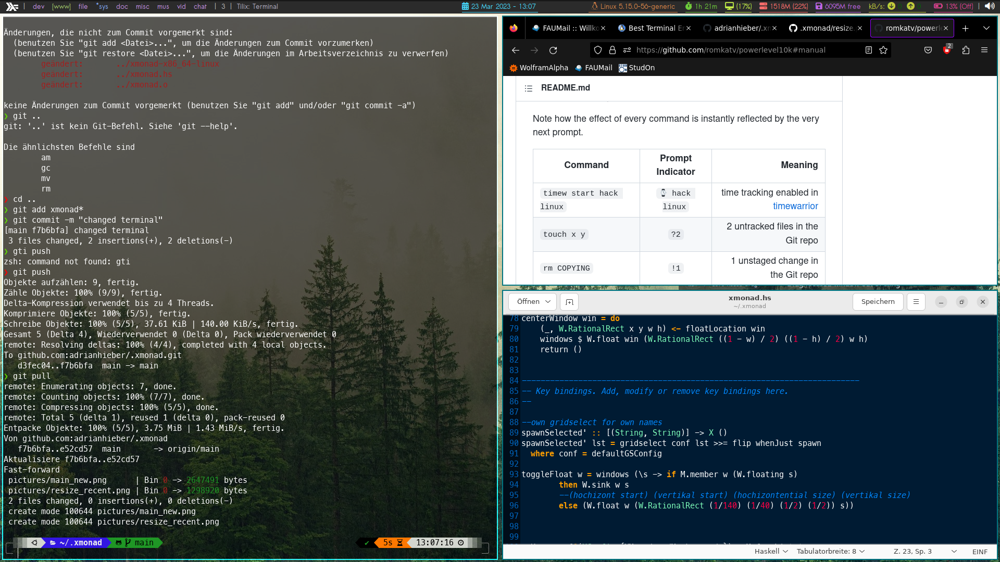
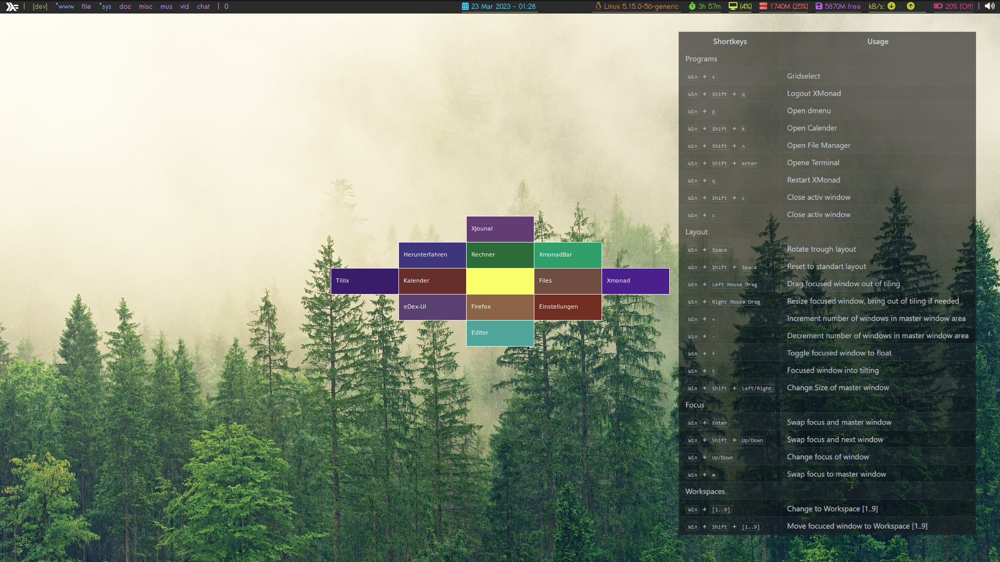

# Xmonad

## Source:
- Xmonad: https://www.youtube.com/watch?v=3noK4GTmyMw
- Xmobar: https://www.youtube.com/watch?v=jCzuMHU3Qtw

## Speicherort:
- Xmonad: ~.xmonad -> config: xmonad.hs
- Xmobar: ~.config -> xmobar

## Shortkeys:
| Shortkeys | Usage |
| ------ | -------- |
| Programs |
| <kbd> Win </kbd>  + <kbd> s </kbd> | Gridselect |
| <kbd> Win </kbd> + <kbd> Shift </kbd> + <kbd> q </kbd> | Logout XMonad |
| <kbd> Win </kbd> + <kbd> p </kbd>  | Open dmenu |
| <kbd> Win </kbd> + <kbd> Shift </kbd> + <kbd> k </kbd>  | Open Calender |
| <kbd> Win </kbd> + <kbd> Shift </kbd> + <kbd> n </kbd>  | Open File Manager |
| <kbd> Win </kbd> + <kbd> Shift </kbd> + <kbd> enter </kbd> | Opene Terminal |
| <kbd> Win </kbd>  + <kbd> q </kbd> | Restart XMonad |
| <kbd> Win </kbd> + <kbd> Shift </kbd> + <kbd> c </kbd>  | Close activ window |
| <kbd> Win </kbd> + <kbd> c </kbd>  | Close activ window |
| Layout |
| <kbd> Win </kbd> + <kbd> Space </kbd> | Rotate trough layout |
| <kbd> Win </kbd> + <kbd> Shift </kbd> + <kbd> Space </kbd> | Reset to standart layout |
| <kbd> Win </kbd> + <kbd> Left Mouse Drag </kbd> | Drag focused window out of tiling |
| <kbd> Win </kbd> + <kbd> Right Mouse Drag </kbd> | Resize focused window, bring out of tiling if needed |
| <kbd> Win </kbd> + <kbd> + </kbd> | Increment number of windows in master window area |
| <kbd> Win </kbd> + <kbd> - </kbd> | Decrement number of windows in master window area |
| <kbd> Win </kbd> + <kbd> f </kbd> | Toggle focused window to float |
| <kbd> Win </kbd> + <kbd> t </kbd> | Focused window into tilting |
| <kbd> Win </kbd> + <kbd> Shift </kbd> + <kbd> Left/Right </kbd> | Change Size of master window |
| Focus |
| <kbd> Win </kbd>  + <kbd> Enter </kbd> | Swap focus and master window |
| <kbd> Win </kbd> + <kbd> Shift </kbd>  + <kbd> Up/Down </kbd> | Swap focus and next window |
| <kbd> Win </kbd>  + <kbd> Up/Down </kbd> | Change focus of window |
| <kbd> Win </kbd>  + <kbd> m </kbd> | Swap focus to master window |
| Workspaces |
| <kbd> Win </kbd> + <kbd> [1..9] </kbd> | Change to Workspace [1..9] |
| <kbd> Win </kbd> + <kbd> Shift </kbd> + <kbd> [1..9] </kbd> | Move focuced window to Workspace [1..9] |

## Screenshots

Home Screen with Xmobar
<!--  -->

Automated window resizing and border color for focused window
<!--  -->

Gridselect

## Build

### Install

`sudo apt install xmonad libghc-xmonad-contrib-dev tilix dmenu`

install git

git clone https://github.com/adrianhieber/.xmonad.git

install xdotool
sudo apt-get install xdotool

Restart

